# Conwayova igra življenja in drugi celični avtomati

predstavitev projektne naloge pri izbirnem maturitetnem pouku informatike v tretjem letniku gimnazije

Gimnazija Vič  
Avtor: Gašper Korošec, 3.B  
Mentor: Klemen Bajec  

## Kazalo
- [Teoretični uvod](#teoretični-uvod)
  - [Kaj je celični avtomat?](#kaj-je-celični-avtomat)
  - [Kako deluje model sistema celičnega avtomata?](#kako-deluje-model-sistema-celičnega-avtomata)
- [Uporaba celičnega avtomata](#uporaba-celičnega-avtomata)
- [Predstavitev različnih algoritmov in mojih implementacij](#predstavitev-različnih-algoritmov-in-mojih-implementacij)
  - [Programska oprema in tehnologije](#programska-oprema-in-tehnologije)
  - [1 dimenzionalni celični avtomati](#1-dimenzionalni-celični-avtomati)
  - [2 dimenzionalni celični avtomati](#2-dimenzionalni-celični-avtomati)
  - [Moje kreacije (Magma in Plants)](#moje-kreacije-magma-in-plants)
  - [Simulacija snovi](#simulacija-snovi)
- [Optimizacija Conwayove igre življenja](#optimizacija-conwayove-igre-življenja)
  - [Prva metoda – Izločanje irelevantnosti](#prva-metoda--izločanje-irelevantnosti)
  - [Druga metoda – Izločanje žive irelevantnosti](#druga-metoda--izločanje-žive-irelevantnosti)
  - [Da poenostavim](#da-poenostavim)
- [Zaključek](#zaključek)
- [Viri](#viri)

# Teoretični uvod
## Kaj je celični avtomat?
Celični avtomat (angleško »Cellular atuomaton«) je model sistema celičnih objektov, za katerega velja, da vsak objekt ''živi'' na mreži, zato objektom pravimo tudi celice. Vsak model celičnega avtomata deluje po pravilih, ki določajo obnašanje vsake posamezne celice skozi iteracije, torej iz enega stanja v drugo, zato lahko model celičnega avtomata uporabimo kot simulacijo v času.

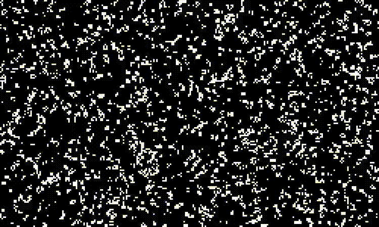

Vsaka celica ima določene lastnosti, ki v večini znanih modelov sledijo tem osnovnim lastnostim:
- Stanje: vsaka celica ima neko stanje. Lahko je predstavljeno na zelo preprost način npr. eno-bitna vrednost 1 ali 0 ali pa na bolj kompleksen način kot npr. več dimenzionalni vektor. Stanja večih celic v mreži lahko uprizorimo z grafičnim upodabljalnikom in tako ustvarimo nek vzorec ali simulacijo.
- Okolica (v angleških virih uporabljena beseda »neighborhood«): Vsaka celica ima določeno ''vidno''  razdaljo oz. polje bližnjih celic. To so celice, preko katerih lahko iz enega stanja preračunamo naslednje stanje celice z uporabo pravil modela celičnega avtomata.
- Pozicija na mreži

## Kako deluje model sistema celičnega avtomata?
Osnovni proces delovanja modela celičnega avtomata sledi preprostim osnovam. Da ustvarimo simulacijo skozi čas, povežemo več iteracij, kjer stanja celic v prejšnji iteraciji diskretno določajo stanja celic v naslednji iteraciji.

Začnemo s prazno mrežo, kateri lastnoročno podelimo stanja celic, ali pa vsaki celici dodelimo naključno prvotno stanje. Uporabimo lahko tudi seme (angleško »seed«), ki določa prvotno stanje simulacije kot približek naključnemu. Uporaba semena je primerna, kadar želimo večkrat ponoviti simulacijo z istim prvotnim stanjem mreže, vendar vseeno želimo občutek naključnosti.

Sledi veriga iteracij. V vsaki iteraciji predelamo vsako celico. Za vsako obdelovano celico opazujemo stanja bližnjih celic v okolici obdelovane celice v prejšnji iteraciji in nato preko pravil sistema določimo novo stanje obdelovane celice. To novo stanje, skupaj s stanji vseh drugih celic, postane osnova za naslednjo iteracijo v simulaciji.
Po vsaki preračunani iteraciji sledi izbirni korak upodabljanja celic. Na določenem mestu, ki ga zavzema celica, upodobimo stanje te celice. Pogostokrat je narisan preprost kvadratek ali '''pixel'', saj lahko preko barve prikažemo stanje celice na človeku prijazen način.

# Uporaba celičnega avtomata
Preprostost delovanja omogoča objektno orientiran način programiranja, kjer preko definiranja in implementacije ene same celice določimo celoto sistema. Ta pristop implementacije je primeren v raznoraznih nalogah in uporabah kot so:

- znanstveno modeliranje v fiziki, kemiji ali biologiji, saj je naš realni svet, tako kot sistem celic v celičnih avtomatih, sestavljen iz mnogo manjših delcev, katerim preprosta pravila določajo obnašanje v okolici.

- interaktivna umetnost, kjer uporabnika očarajo vzorci simulacije in omogočajo uporabo človeške domišljije. V to skupino spadajo tudi računalniške igrice, pretežno zaradi uporabe sistemov delcev (angleško »particle systems«) in igrice, kjer je svet sestavljen iz celic. Odličen primer računalniške igrice, ki uporablja sisteme celičnih avtomatov, je 'Noita', kjer je vsak pixel v svetu svoja lastna celica, kar omogoča zelo interaktivno in natančno medsebojno obnašanje celic za simuliranje gostote snovi, poškodbe materiala ter širjenje ognja in razjedanje kisline.

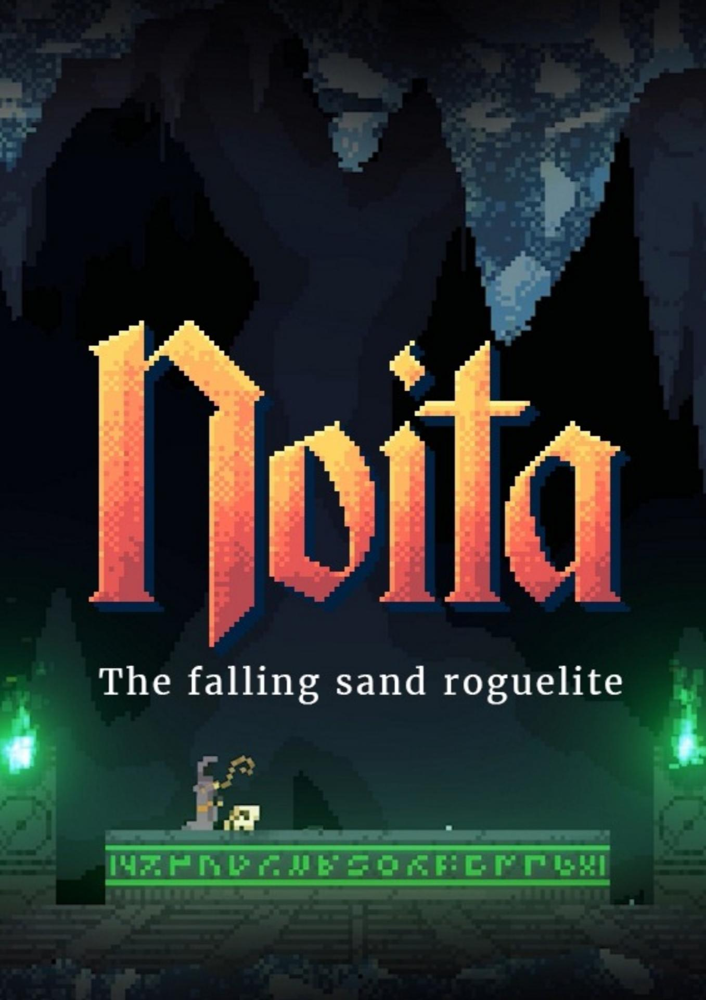

# Predstavitev različnih algoritmov in mojih implementacij
## Programska oprema in tehnologije:
Za svojo implementacijo štirih različnih algoritmov sem uporabil programski jezik Python in grafični upodabljalnik Pygame. Za Python sem se odločil, ker je preprost jezik s katerim imam že veliko izkušenj pisanja manjših projektov in simulacij. Pygame pa je preprost in hiter upodabljalnik, odličen za simulacije in igre, saj omogoča prikaz na ekran v okence, vnos uporabnika in tudi zvok, čeprav ga za ta projekt nisem uporabil.

V naslednjih točkah te dokumentacije bom predstavil 5 algoritmov, od katerih sem 4 implementiral tudi sam. Izpuščena je implementacija 1 dimenzionalnih celičnih avtomatov, saj je le preprostejša oblika 2 dimenzionalnih algoritmov.

## 1 dimenzionalni celični avtomati
Sistem 1 dimenzionalnega celičnega avtomata je eden izmed najbolj preprostih sistemov. Mrežo sistema si lahko predstavljamo kot ravno vrsto celic ali bitov, kjer je stanje vsake celice lahko 1 ali 0 – živo ali mrtvo.

Nato moramo določiti pravila obnašanja celic skozi iteracije. Vsaka celica ima točno 2 soseda, levega in desnega, zato, ko opazujemo stanja vseh 3 celic, opazimo, da obstaja le 8 različnih možnosti medsebojnih stanj teh 3 celic. Da sestavimo pravila avtomata, moramo za vsako možno stanje te lokalne okolice 3 celic določiti rezultat oz. končno stanje obdelovane (sredinske) celice.

Tukaj je primer preprostih pravil za tak sistem:

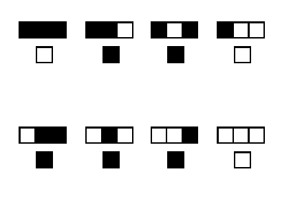

Ko simuliramo več iteracij se pojavi vzorec: (vsaka nova iteracija je nova vrstica)

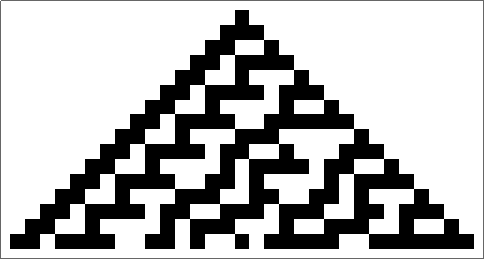

Tukaj pa je primer vzorca v realnem svetu, in sicer kot vzorec školjke:

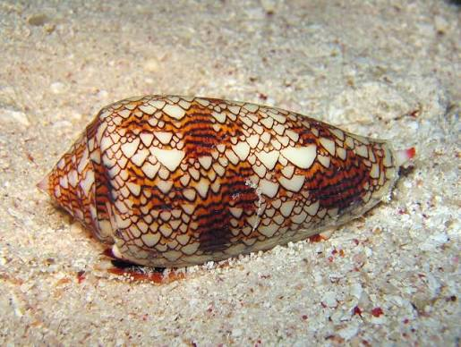

## 2 dimenzionalni celični avtomati

[Implementacija: Conwayova igra življenja](Source/Conways/Conways.py)

Če 1 dimenzionalnemu sistemu dodamo še eno dimenzijo, lahko mrežo predstavimo kot matrico, kjer ima vsaka celica 8 sosednih celic (9 skupaj z obdelovano), zato obstaja 2**9 oz. 512 različnih možnosti. 

Ker bi določanje pravil za vsako možno konfiguracijo teh devetih celic bilo preveč zahtevno, lahko pravila poenostavimo tako, da namesto vseh možnih konfiguracij samo preštejemo vse žive sosednje celice in tako določimo stanje obdelovane celice v novi iteraciji.

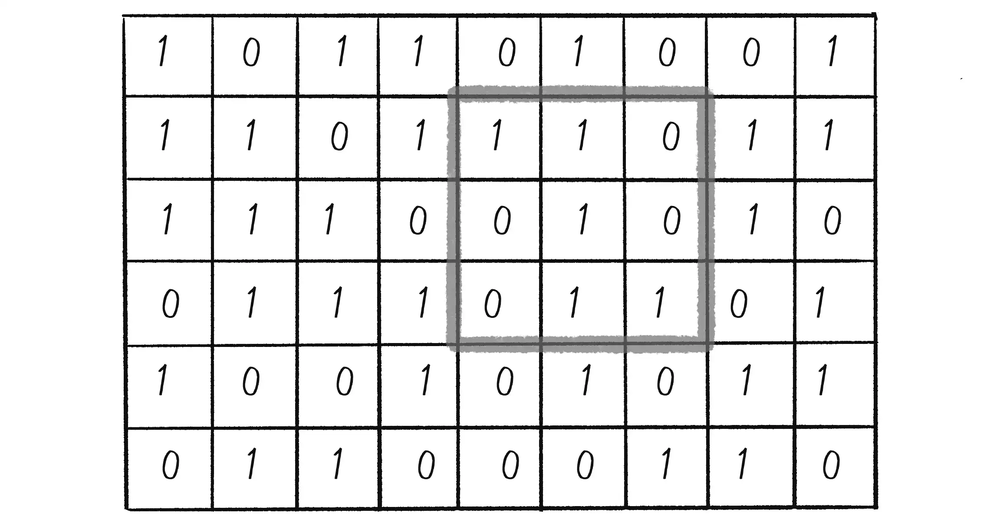

Conwayova igra življenja (v originalnih angleških virih poimenovano »Conway's Game of Life«) je sistem 2 dimenzionalnega celičnega avtomata s poenostavljenimi pravili:
- Živa celica z manj kot dvema živima sosednjima celicama umre
- Živa celica z dvema ali tremi živimi sosednjimi celicami preživi in nadaljuje v naslednjo iteracijo
- Živa celica z več kot tremi živimi sosednjimi celicami umre
- Mrtva celica s točno tremi živimi sosednjimi celicami se regenerira

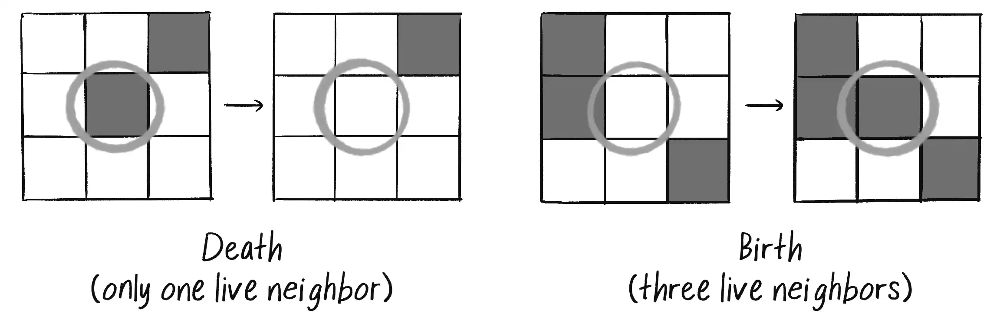

Ta pravila, ki jih je ustvaril John Conway, so posebna, saj potrebujejo mnogo iteracij, da se ustavijo oz. preidejo v ravnovesje, hkrati pa omogočajo zelo kompleksno obnašanje in zelo nepredvidljive vzorce.

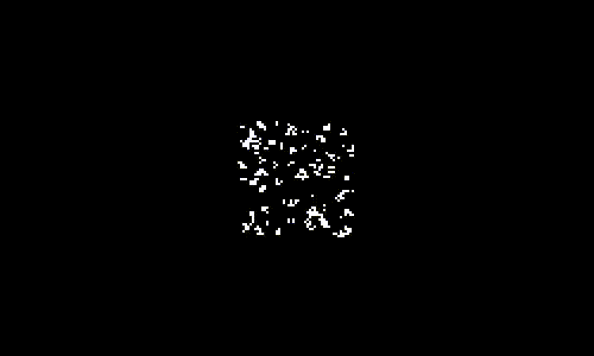

Takoj lahko opazimo manjše ponavljajoče vzorce oz. skupnosti celic. Te različne skupnosti je John Conway razdelil na 3 razrede, glede na obnašanje.

''Tihožitja'' (v angleških virih »still lives«) so skupnosti celic, ki so v ravnovesju in se skozi iteracije ne spremenijo, dokler na njih ne vpliva neka zunanja sprememba.

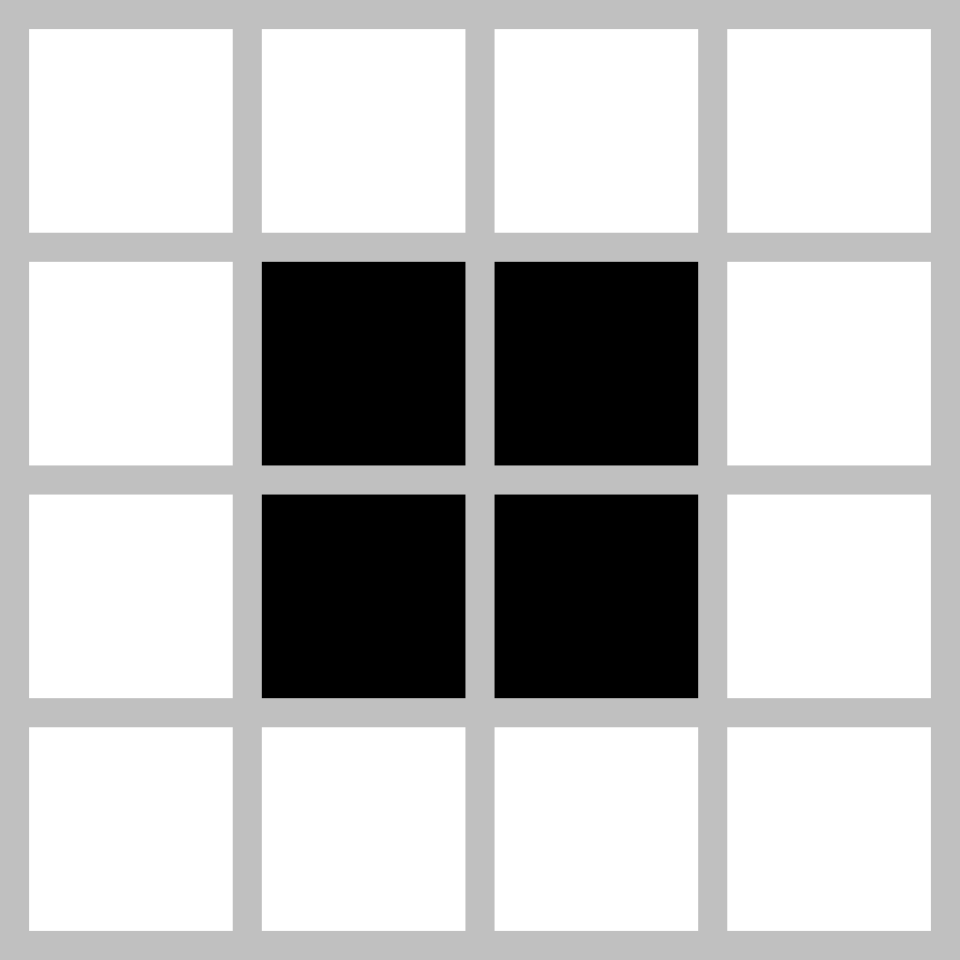  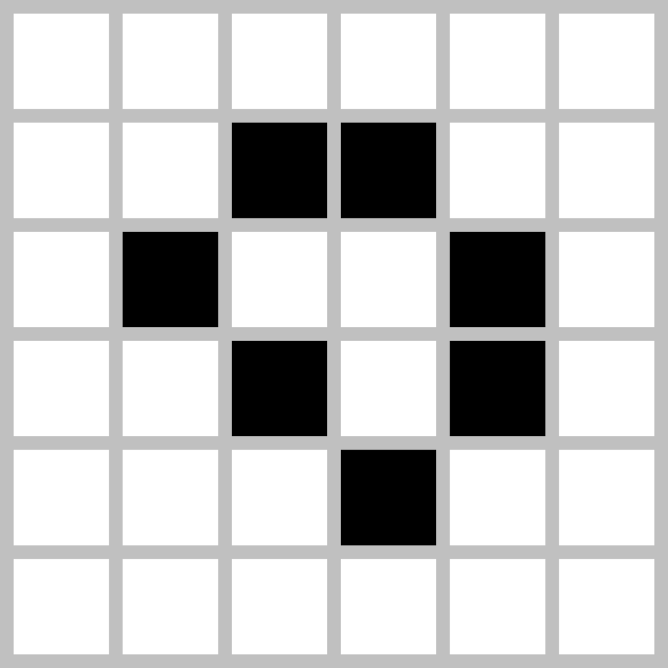

''Oscilatorji'' (v angleških virih »oscillators«) so skupnosti celic, ki preko iteracij spreminjajo obliko, a se čez določeno število različnih oblik vrnejo na prvotno stanje. Oscilaorji so lahko zelo preprosti in imajo samo 2 možni stanji, torej potrebujejo 2 iteraciji za celotno zanko, lahko pa so zelo kompleksni in potrebujejo 15 ali več iteracij.

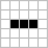  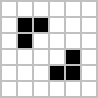

  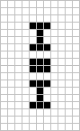

''Jadralci'' (v angleških virih »gliders«) so skupnosti celic, ki preko iteracij spremenijo obliko in se čez določeno število različnih oblik vrnejo na prvotno stanje, hkrati pa se kot celotna skupnost celic premaknejo v mreži, torej so oscilatorji, ki se premikajo.

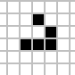  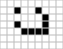  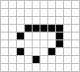

Conwayova preprosta pravila tvorijo tako kompleksen sistem, da velika množica vzorcev še vedno ni bila odkrita. 

Raziskovalci so odkrili tudi druge razrede, kot na primer vzorec skupnosti celic, ki sestavlja več jadralcev in so celo uspeli ustvariti logična vrata, kjer so jadralci uporabljeni kot pretok informacij med temi logičnimi vrati. To pomeni, da bi v teoriji lahko ustvarili prvotno stanje celic, ki bi simuliralo samo Conwayovo simulacijo, torej bi imeli simulacijo znotraj simulacije.

[Phillip Bradbury : Life in life](https://www.youtube.com/watch?v=xP5-iIeKXE8)

## Moje kreacije (Magma in Plants)

[Implementacija: Pravila po meri](Source/CustomRules)

Do sedaj sem predstavil simulacije, kjer je stanje celic 1 bitno ''živo'' ali ''mrtvo'', toda sistem nam omogoča veliko več kreativnosti. V svojih dveh implementacijah, ki sem ju poimenoval ''Magma'' in ''Plants'' sem stanje predstavil kot celo število med 0 in 255, torej 8 bitno število. To mi je omogočilo, da stanje celice upodobim z RGB barvnim formatom, kjer je barva sestavljena iz treh 8-bitnih kanalov osnovnih barv, to so rdeča, zelena in modra. Za pravila pa sem opazoval vsoto intenzivnosti življenja oz. vsoto vseh stanj sosednjih celic in ga primerjal z neko konstantno mejo. Glede na primerjavo intenzivnosti življenja sosednih celic in teh konstantnih mej, sem originalno stanje pomnožil s faktorjem in tako pridobil novo stanje.

V prvi simulaciji mi je uspelo ustvariti efekt magme, ki se topi s časom, v drugi pa efekt rastja rastlin.

  

## Simulacija snovi

[Implementacija: Simulacija snovi](Source/CellularWorld/main.py)

Zadnja vrsta sistemov celičnih avtomatov, ki jo bom predstavil, je simulacija snovi. Ta vrsta je uporabljena v igrici ''Noita'', ki sem jo omenil že pri uporabi celičnih avtomatov. Za simulacije snovi je značilno, da stanje celic določa snov celice, kako se ta celica obnaša v praznem prostoru in kako se obnaša pri kontaktu z drugo snovjo.
 Najpogosteje je implementiran pesek, saj pravila obnašanja na zelo preprost način imitirajo realno akumulacijo peska v peščene sipine.
Pesek sledi preprostim pravilom:

Če je spodnja celica prazna, se njeno stanje spremeni v pesek, stanje trenutno obdelovane celice pa v prazno celico, to ustvari efekt premikanja celice navzdol. Če je spodnja celica zasedena, pogleda njeno levo in desno sosednjo celico. Če je ena izmed tih dveh prazna, se premakne na drugo, če pa sta obe prazni, naključno izbere eno in se premakne nanj. Če so vse 3 spodnje celice zasedene, se trenutno stanje celice ne spremeni in pesek ostane na miru. Ta preprosta pravila omogočajo, da se pesek enakomerno nabira v trikotno peščeno sipino.

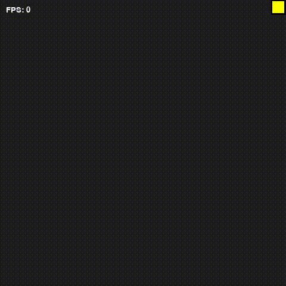

Da pridobimo efekt tekočine, lahko uporabimo pravila peska kot osnova. Tekočina, kot na primer voda, naj se obnaša na enak način kot pesek, razen takrat, ko so zasedene vse 3 spodnje celice. V tem primeru celica preveri tudi levo in desno sosednjo celico, ugotovi katera je prazna, in se premakne nanjo. S tem preprostim dodatkom ustvarimo značilno obnašanje tekočine, kjer prehaja proti najnižji točki v lokalni okolici.

Kot sem že omenil v uvodu simulacij snovi, je značilno, da snovi med seboj reagirajo na različne načine. S peskom in vodo lahko ustvarimo novo celico – pesek nabit z vodo – ki se obnaša kot inertna celica, torej se preprosto ne premika in ohranja svoje stanje skozi čas.

Nastanek te nove snovi lahko določimo tako, da pravilom peska dodamo novo pravilo. Kadar je na katerikoli sosednji celici prisotna voda, se obdelovana celica (torej pesek) spremeni v pesek, nabit  vodo. S temi tremi različnimi snovmi in njunimi preprostimi pravili obnašanja že lahko simuliramo geografski nastanek doline Smrti, kjer se z leti nabiranja peska in zalivanja vode ta pesek strdi in ustvari se nova plast trdnega kamenja.

Preko teh medsebojnih odnosov lahko simuliramo tudi les in ogenj, ter nastajajoč dim. Les je preprosta inertna celica, ki ohranja stanje skozi iteracije, z dodanim pravilom, da se ob prisotnosti ognja pretvori v ogenj. Ogenj pa je malo bolj kompleksen. Za obnašanje ognja je značilno, da se premika navzgor, a ne tako hitro kot dim. 
Da omejimo hitrost premikanja, lahko pri vsaki iteraciji, kjer bi se ogenj pomaknil navzgor, dodamo nekaj učinka naključnosti tako, da z generatorjem naključnega števila med 0 in 1 generiramo neko število in ga primerjamo s številom (npr. 0.8), ki določa kakšna je možnost premika ognja navzgor. Če je generirano število 0.9, meja za premik navzgor pa je 0.8, potem se ogenj premakne navzgor, če pa je generirano število manjše od meje (npr. 0.7), pa ostane na svojem mestu. Tako upodobimo 20% možnost premika ognja navzgor.

Z uporabo naključnosti lahko simuliramo tudi potrebo ognja po gorivu in tvorbo saj plamena. Vsako iteracijo preverimo naključnost na enak način kot za premikanje, in določimo, ali se ogenj pretvori v celico saj/dima, ali ostane v obliki plamena. Dim se obnaša na podoben način kot tekočine, vendar v nasprotno smer, torej navzgor.
S temi tremi snovmi in uporabo naključnosti lahko na precej zanimiv način simuliramo njihovo medsebojno obnašanje v realnem svetu.

Dodamo lahko tudi led, ki je preprosta celica, ki se ohranja skozi čas, a ima vsako iteracijo majhno možnost pretvorbe v vodo. Ta možnost je lahko povečana, kadar je v okolici prisoten ogenj.

# Optimizacija Conwayove igre življenja
2 dimenzionalni celični avtomati v osnovi uporabljajo algoritem s časovno kompleksnostjo O(n**2 * 8), kjer n predstavlja število vseh celic v mreži ( množeno s številom sosednjih celic). (O((w*h)**2 * 8) kadar sta širina w in višina h drugačna).

Ta način, kjer mora biti obdelana vsaka celica in njene sosednje celice, ni optimiziran, zato sem našel in implementiral 2 koncepta optimizacije.
Obe metodi izvirata iz preproste spremembe v koraku preračunavanja novega stanja celice (to je takrat, ko je nova mreža v procesu polnjena s stanji novih celic). Metodi določita aktivnost oz. relevantnost celice in to celico dodata v seznam celic, ki morajo biti obdelane v naslednji iteraciji. (V seznam celic je dodana pozicija celice v mreži, torej koordinati, saj shranjujemo katere celice so aktivne)

To poenostavi kompleksnost računanja nove iteracije tako, da preprosto izpusti celice, za katere smo lahko prepričani, da se ne bodo spremenile v naslednji iteraciji, torej jih ni potrebno preračunavati.

Obe metodi sta nekoliko podobni, saj je druga metoda le nadgradnja prve.
## Prva metoda – Izločanje irelevantnosti

Psevdokoda:
ko je novo stanje celice odločeno
	če je celica živa ali če je katerakoli sosednja celica živa
		dodaj pozicijo celice in vseh sosednjih celic v seznam aktivnih celic

[Implementacija: Optimizacija z metodo odstranjevanja irelevantnosti](Source/Conways/Conways_irrelevanceCheck.py)

Ta pristop omogoča, da so celice, ki se ne spreminjajo v naslednji iteraciji, saj nimajo živih sosednjih celic, niso vključene v seznam celic, ki so znova preračunane. Če na grafični upodobitvi prikažemo, katere celice so irelevantne, opazimo, da to vsebuje veliko praznega prostora, ki je v originalni metodi O(n**2 * 8) še vedno bil vključen v preračunanje.

Modro obarvane celice so aktivne / relevantne celice, ki jih znova preračunamo vsako iteracijo

Metoda izločanja irelevantnosti omogoča, da je originalna časovna kompleksnost tokrat le najvišja možna kompleksnost, in ne osnovna privzeta kompleksnost.

## Druga metoda – Izločanje žive irelevantnosti
Metoda izločanja irelevantnih celic je že precej boljša od osnove, a še vedno obstaja možnost za optimizacijo. Ko sem opazoval, katere celice so aktivne, sem opazil, da so vključene tudi skupnosti celic v razredu ''tihožitja'', to so celice, ki skozi iteracije ne spreminjajo stanja.

Psevdokoda:
Ko je novo stanje celice določeno
	Če je to novo stanje drugačno od prejšnjega stanja
		dodaj pozicijo celice in vseh sosednjih celic v seznam aktivnih celic

[Implementacija: Optimizacija z metodo odstranjevanja žive irelevantnosti](Source/Conways/Conways_liveIrrelevanceCheck.py)

Lahko smo popolnoma prepričani, da se celice, ki ohranjajo svoje stanje skozi 2 iteraciji, ne bodo spremenile (so irelevantne), zato jih lahko izpustimo, tako kot prazen prostor.

Rdeče obarvane celice so aktivne / relevantne celice, ki jih znova preračunamo vsako iteracijo. Tukaj lahko opazimo, da so skupine celic v razredu Tihožitij določene kot neaktivne / irelevantne

Tukaj pa je pomembno omeniti še dodatno spremembo. Ker vsakič, ko ustvarimo novo mrežo za naslednjo iteracijo, to mrežo ustvarimo brez nobene vsebine, torej polno praznih celic, pomeni, da so v metodi izločanja živih irelevantnih celic na novi mreži ne obdela teh živih celic in se zato izbrišejo. Tega problema se rešimo tako, da namesto ustvarjanja nove prazne mreže le prilagodimo staro mrežo (kopiramo mrežo in jo spremenimo, torej NE pišemo novih stanj celic na isti mreži, s katere beremo stara stanja).
Ta metoda je torej nadgradnja prve metode, saj izpusti ne le prazne ''mrtve'' irelevantne celice ampak tudi žive irelevantne celice.

Optimizaciji sem prikazal na grafu FPS (»frames per second«) v odvisnosti od časa (prva slika) ter na grafu števila aktivnih celic v odvisnosti od časa (druga slika) in ju primerjal z osnovnim algoritmom.

- zelena črta predstavlja simulacijo, ki uporablja osnovni algoritm
- modra črta predstavlja simulacijo, ki uporablja prvo metodo
- rdeča črta pa predstavlja simulacijo, ki uporablja drugo metodo

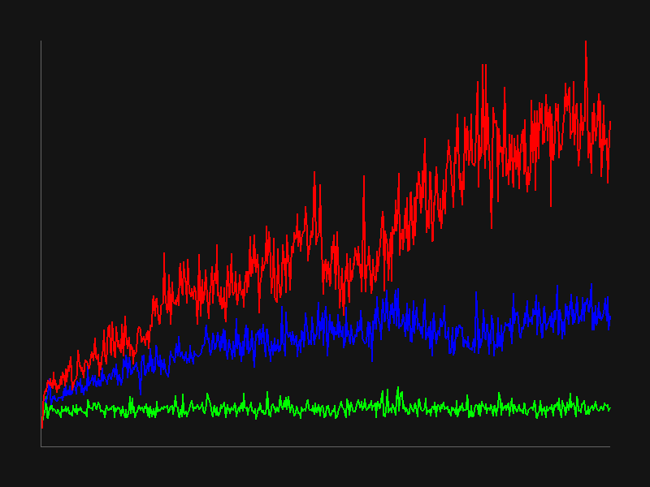  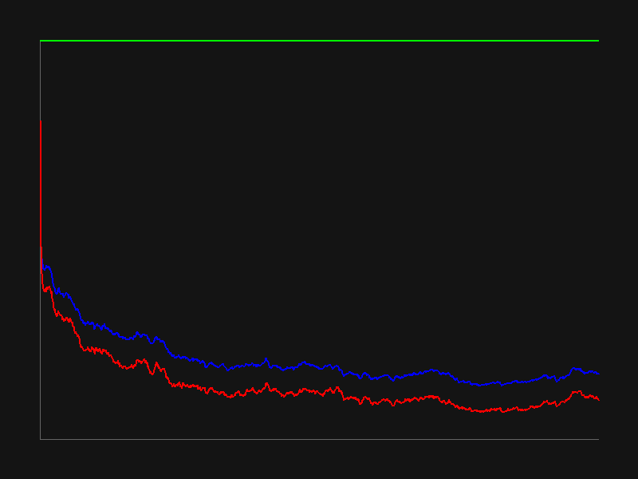

Opisani metodi delujeta za osnovni algoritem Conwayove igre življenja ali drugih preprostejših 2 dimenzionalnih celičnih avtomatih, kjer pravila delujejo na osnovi števila  8 sosednjih živih celic.

Po drugi metodi optimizacije sem prišel do točke, kjer preračunavanje ni več najbolj računsko kompleksna operacije v simulaciji, temveč je to risanje kvadratkov na grafičnem upodabljalniku. Če bi želeli še bolj optimizirati tudi ta proces, bi za optimizacijo risanja uporabili variacijo prve metode in se tako izognili risanju praznega prostora oz. črnih kvadratkov. Druga metoda v tem primeru ne bi bila primerna, saj, kot že omenjeno, izbriše žive celice iz preračunave, zato, čeprav bi obstajale v internem 2 dimenzionalnem seznamu, ne bi bile narisane.

## Da poenostavim:
Originalen algoritem Conwayove igre življenja ni optimiziran. Glavni cilj optimizacije je, da ne preračunamo irelevantnih celic. Prva metoda odstrani prazen prostor (mrtve irelevantne celice), druga metoda pa tudi ''tihožitje'' (žive irelevantne celice).  Ostane nam optimiziran algoritem, ki je skoraj 10-krat hitrejši in bolj učinkovit od osnovnega.

# Zaključek
Celični avtomati predstavljajo izjemno zanimiv in vsestranski model, ki s preprostimi lokalnimi pravili omogoča nastanek kompleksnih globalnih vzorcev. V tem poročilu sem predstavil osnovne principe njihovega delovanja, različne tipe algoritmov ter konkretne primere uporabe, od enodimenzionalnih sistemov do kompleksnejših dvodimenzionalnih modelov, kot je Conwayova igra življenja.

Skozi implementacijo lastnih simulacij sem pokazal, kako lahko z razširitvijo koncepta stanja celice dosežemo vizualno bogate in dinamične učinke, kot sta simulacija magme in rastja. Poleg tega sem prikazal, kako se celični avtomati uporabljajo za simulacijo fizikalnih pojavov, kot so pesek, tekočine in ogenj, kar dodatno potrjuje njihovo uporabnost pri modeliranju realnega sveta.

Pomemben del naloge je bila tudi optimizacija algoritmov, kjer sem z uvedbo metod za izločanje irelevantnih celic bistveno izboljšal časovno učinkovitost simulacije. Rezultati kažejo, da lahko z ustreznimi pristopi zmanjšamo računsko zahtevnost in omogočimo hitrejše izvajanje tudi pri večjih mrežah.
Na koncu lahko zaključim, da celični avtomati niso le teoretični koncept, temveč močno orodje za simulacijo, raziskovanje kompleksnih sistemov in ustvarjanje interaktivnih vizualnih vsebin. Njihova preprostost v osnovi in hkrati neomejen potencial za kompleksnost jih uvršča med pomembne modele tako v znanosti kot tudi v računalniški grafiki in umetnosti.

# Viri
Wikipedija: Celični avtomati - https://en.wikipedia.org/wiki/Cellular_automaton

Wikipedija: Conwayova igra življenja - https://en.wikipedia.org/wiki/Conway%27s_Game_of_Life

Daniel Shiffman : ''Nature of code'' - https://natureofcode.com/

Phillip Bradbury : ''Life in life'' - https://www.youtube.com/watch?v=xP5-iIeKXE8
